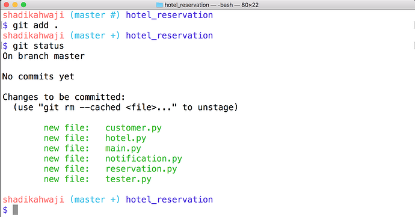

<h2>

:construction: ورشة عمل (4) البدء بمشاركة الكود على GitHub 

</h2>

<h2>

:computer_mouse: شرح برنامج الورشة:

</h2>

من المهم أن تتعرف على طريقة حفظ إصدارات الكود المختلفة حتى تتابع تقدمك في أي مشروع وخصوصا في الورش التي نعمل عليها حاليا. في هذه الورشة سنقوم بحفظ ملفات برنامجنا على مستودع بعيد لكي يسهل علي متابعة تقدمكم.

<h3>

:page_with_curl: ملف البرنامج:

</h3>

في الورشة السابقة تكوّن عندنا مجموعة ملفات، حان الوقت لإدخال إدارة الإصدارات لمشروعنا الصغير :smile: 

  •	hotel.py
  • customer.py
  • reservation.py
  •	notification.py
  •	tester.py
  • main.py

<h2>

:wrench:  تطبيق الورشة

</h2>

في هذه الورشة سنقوم بإضافة ملفات برنامجنا على مستودع محلي local repo ثم سنقوم بترحيل الملفات إلى مستودع بعيد على GitHub: 

<h3>

إنشاء مستودع repo محلي:

</h3>

أولا انتقل إلى الفولدر الخاص بالمشروع الذي عملت عليه في الورشات السابقة:
ومن ثم يجب أن ننشئ مستودع محلي local repo  عن طريق الأمر التالي:

    git init

<h3>

إضافة ملفات البرنامج للمستودع المحلي local repo:

</h3>

إذا يجب أن ننفذ إضافة الملفات عن طريق الأمر:

    git add . 

إذا كان هناك  ملفات لا تريد أن تشملها من ضمن الأمر السابق مثل ملفات التوثيق documents أو ملفات نصوص عادية ليس لها علاقة بالكود يمكن إضافتها ل ملف .gitignore

بعد إضافة الملفات أصبحنا جاهزين لتثبيت الملفات على المستودع المحلي عن طريق:

    git commit -m “initial commit”

<h3>

أتمنى التوفيق للجميع من كل :heart: :blush:

</h3>
